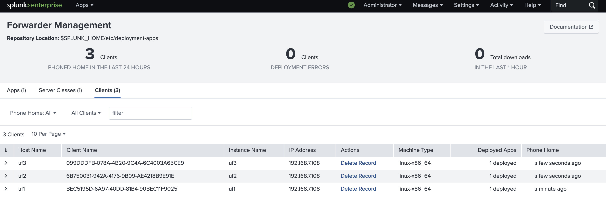
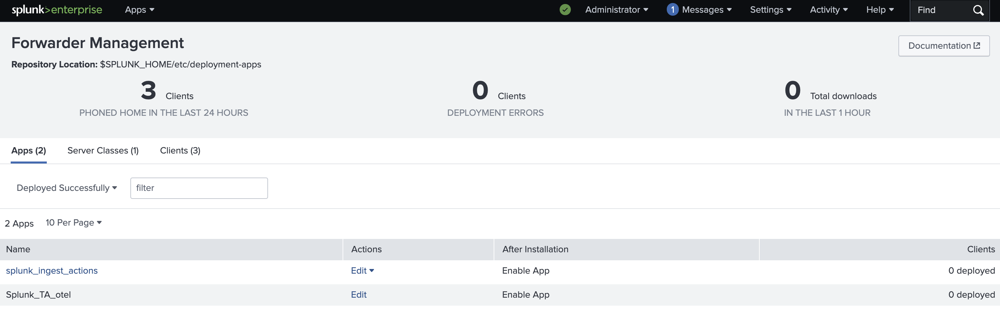
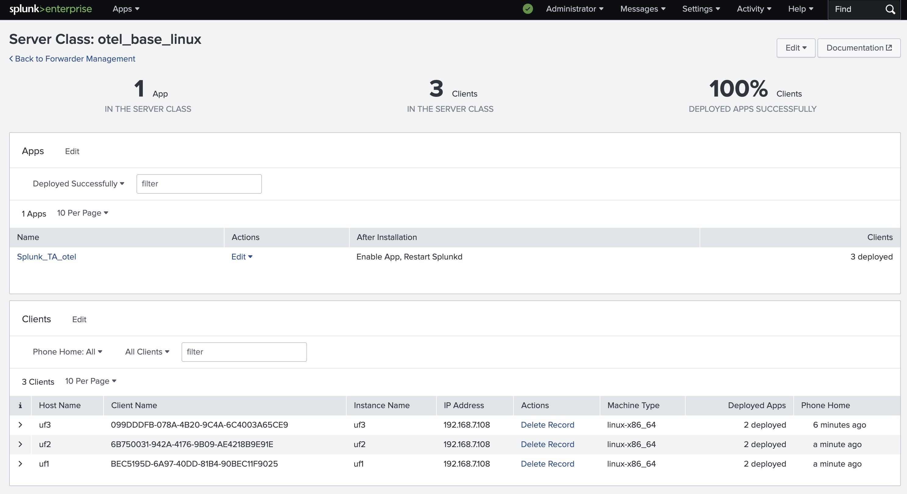
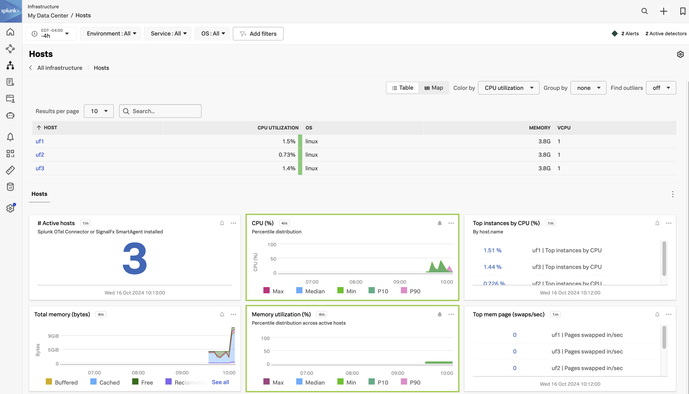
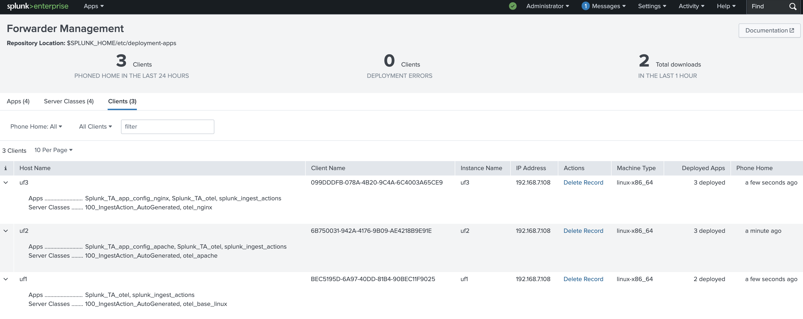

# OTel TA

The OTel TA is a way for customers who already use the Splunk Universal Forwarder (UF) with the Deployment Server to distribute the Open Telemetry Collector and config files.

This example is meant for someone with minimal Splunk knowledge.

It will assume a setup needing three configurations:
* A Splunk OTel Collector collecting only the operating system
* A Splunk OTel Collector collecting the operating system and Apache
* A Splunk OTel Collector collecting the operating system and Tomcat

If you need a configurating that includes multiple apps, the current recommendation is to have a configuration with both in one (vs. sending the base, apache, and tomcat), for reasons that will become obvious once you see how this configuration is set up.

## Outline

The following represents the set of steps needed to achieve this:
* Install Splunk
* Install UF on 3 endpoints
* Setup Deployment Server
  * Deploy OTel Collector with base config
  * Test the base configuration
  * Deploy configurations for apache and nginx
  * Test the configurations for all 3 servers

### Install Splunk
For this example we will simply use docker to run our server. NOTE this document is not reflecting best practices for deploying Splunk. For example we are deploying without a proper cert, and we are using simple passwords that should not be used in production.

After installing docker (and docker compose), create a docker compose file (`compose.yaml`):
```
version: "3.3"
services:
  splunk:
    ports:
      - 8000:8000
      - 8089:8089
      - 9997:9997
    environment:
      - SPLUNK_PASSWORD=password
      - SPLUNK_START_ARGS=--accept-license
    stdin_open: true
    tty: true
    image: splunk/splunk:latest
    volumes:
      - /splunk/etc:/opt/splunk/etc
      - /splunk/var:/opt/splunk/var
networks: {}
```

You will need to create the folder `/splunk` on your system; you can substitute this for another folder, just replace the first part of the volume lines with the folder you use.

Then launch it from the same directory the `compose.yaml` is in with:
```
docker compose up -d
```

### Install UF on 3 endpoints
We'll use 3 linux boxes for the purposes of this setup.

On each box run the following commands. You can update the version of the UF, and change the IP address to use the one your Splunk server is running on:
```
sudo useradd -m splunkfwd
sudo groupadd splunkfwd
cd /opt
sudo wget -O splunkforwarder.tgz "https://download.splunk.com/products/universalforwarder/releases/9.3.1/linux/splunkforwarder-9.3.1-0b8d769cb912-Linux-x86_64.tgz"
sudo tar xvzf splunkforwarder.tgz
sudo chown -R splunkfwd:splunkfwd /opt/splunkforwarder
sudo /opt/splunkforwarder/bin/splunk start --accept-license
<enter admin and password>
sudo /opt/splunkforwarder/bin/splunk add forward-server 192.168.7.240:9997
sudo /opt/splunkforwarder/bin/splunk set deploy-poll 192.168.7.240:8089
```

then wait for a bit (can take several minutes to appear)

You can check the logs with: sudo tail -f /opt/splunkforwarder/var/log/splunk/splunkd.log

You are looking for a line like this:
10-15-2024 13:00:39.238 -0400 INFO  AutoLoadBalancedConnectionStrategy [1689 TcpOutEloop] - Connected to idx=192.168.7.240:9997:1, pset=0, reuse=0. autoBatch=1

Then refresh "Forwarder Management". It may take a few more seconds to appear.



### Deploy OTel Collector with base config

Next we need to add the contents that we want to push to all of the systems. We will start by simply downloading the TA and making the minimal changes needed to start collecting metrics to send to Splunk Observability Cloud.

First, download the TA from [here](https://splunkbase.splunk.com/app/7125). (You will need a splunk.com account to download it; this is free to setup.)

Our docker setup is exposing the `etc` folder to the host machine. So you can place this archive inside the `/splunk/etc/deployment-apps` folder. (NOTE: If you used a different local folder than `/splunk` then adjust accordingly.)

We need to change a few files to make this work:

```
# Create a new file, /Splunk_TA_otel/local/access_token
Paste your ingest token in this file.

# /Splunk_TA_otel/default/inputs.conf
Set the following (unless your realm is us0). For example for us1:
splunk_api_url=https://api.us1.signalfx.com
splunk_ingest_url=https://ingest.us1.signalfx.com
splunk_trace_url=https://ingest.us1.signalfx.com/v2/trace
splunk_realm=us1
```

To make sure this directory can be written to, use `chown -R` to match the existing files in this directory. For example:
```
sudo chown -R 41812:41812 Splunk_TA_otel
```

You can confirm the TA has been deployed to splunk on the apps tab:


### Test the base configuration

Now we have the configuration set, we need to tell Splunk which collectors to send it to, as well as restart after running.

First, switch to the `Server Classes` tab and create a new server class named `otel_base_linux`. Make the following settings:
* For apps, include `Splunk_TA_otel`
* Make sure the app will restart splunkd. (You will need to edit the app now to do that)
* Finally set the clients, include `uf*`

The result should look like the following:


If all goes well you will get collectors in Splunk Observability. If you are running hosts locally you will find them under `Infrastructure >  My Data Center > Hosts`. If they are in the cloud then they will be under the appropriate cloud tile:
* `AWS EC2`
* `Azure Virtual Machines`
* `Google Cloud Platform Compute Engine`
* etc.

For example:


### Deploy configurations for apache and nginx

Next we want to look at configuring configuration deployments for various apps.

Each configuration needs to stand on its own. For example if a system has apache and tomcat you would need a configuration containing both receivers. But it can be separated from the install files.

For our example we will create one configuration for apache and one for tomcat, and push them to uf2 and uf3 (respectively).

To set this up let's configure the following folder structure under `/etc/deployment-apps`, using the files from [here](configuration-files):
```
/etc
  /deployment-apps
    /Splunk_TA_otel
      <install files and default configuration>
    /Splunk_TA_app_config_apache
      /configs
        otel-apache.yaml
      /local        
        inputs.conf
    /Splunk_TA_app_config_tomcat
      /configs
        otel-tomcat.yaml
      /local        
        inputs.conf
```

For this example we are only setting a new config file (i.e. `otel-apache.yaml`) in our `inputs.conf` file, but we could also make other changes (like pointing to a separate `access_token` file).

Let's first deploy these two apps.

On uf2, deploy apache:

```
sudo apt update
sudo apt install apache2
```

On uf3, deploy nginx:

```
sudo apt update
sudo apt install nginx
sudo vi /etc/nginx/sites-available/default
```

and then add the following to `server` block, after the 2 listen statements:
``` conf
location /status {
  stub_status;
  allow all;
}
```

and finally test the configuration with `nginx -t`. Then you will either need to start or restart nginx (try both):
* `nginx`
* If you get errors that the address is already in use: `nginx -s reload`

And you can test the status with:
```
curl http://localhost/status
```
### Test the configurations for all 3 servers

Then we can remap the clients:
* uf1 - base
* uf2 - base and apache
* uf3 - base and nginx

It should look like this:


And in Splunk Observability you will find metrics for apache and nginx, such as:
* apache: `apache.traffic`, `apache.uptime`, `apache.requests`, etc.
* nginx: ``

## Tips and Tricks
* In our example we simply deployed the otel base, which included both linux and windows files. These could be separated into apps relevant for each operating system.
* Make sure the app includes restarting splunkd
* If you aren't sure what is going on you have a few options
  * On the Splunk Server you can run `/opt/splunk/bin/splunk reload deployment-server` to redeploy
    * You can run this with the option `-class [serverclass name]` to do this for just a specific server class
  * Alternatively you can uninstall the app and then set it up again
* The following logs are useful to monitor
  * `/opt/splunk/var/log/splunk/Splunk_TA_otel.log`: For the lifecycle of the TA and OTel Collector
  * `/opt/splunk/var/log/splunk/otel.log`: For the otel collector itself