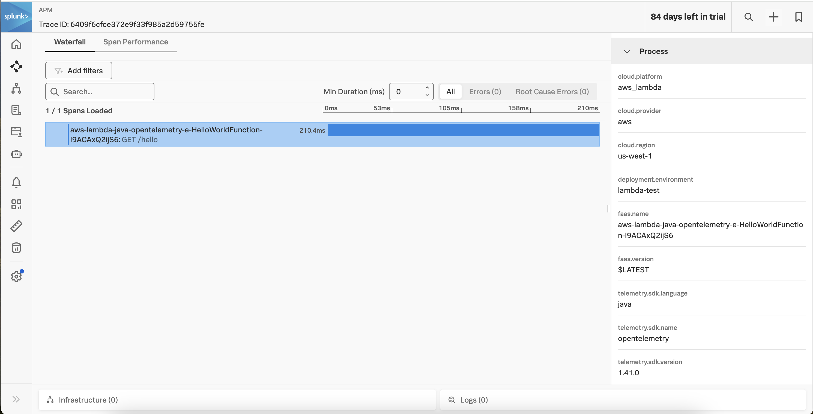
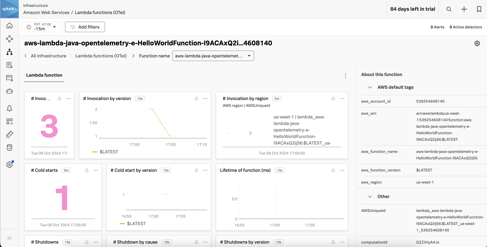

# Instrumenting a Java AWS Lambda Function with OpenTelemetry

This example demonstrates how to instrument an AWS Lambda function written in
Java using OpenTelemetry, and then export the data to Splunk Observability
Cloud.  We'll use Java 21 for this example, but the steps for earlier Java versions 
are similar.  The example also uses the AWS Serverless Application Model (SAM)
CLI to deploy the Lambda function and an associated API Gateway to access it.

## Prerequisites

The following tools are required to deploy Java functions into AWS Lambda using SAM:

* An AWS account with permissions to create and execute Lambda functions
* Java 21 JDK
* Download and install [AWS SAM](https://docs.aws.amazon.com/serverless-application-model/latest/developerguide/install-sam-cli.html)

## Application Overview

If you just want to build and deploy the example, feel free to skip this section.

The application used here is based on the "Hello World" example application that's part of the
[AWS Quick Start templates](https://docs.aws.amazon.com/serverless-application-model/latest/developerguide/using-sam-cli-init.html).

The provided template.yaml.base file was then updated to set the `AWS_LAMBDA_EXEC_WRAPPER` environment
variable to `/opt/otel-proxy-handler`, since our example lambda function is wrapped with API Gateway: 

````
      Environment: # More info about Env Vars: https://github.com/awslabs/serverless-application-model/blob/master/versions/2016-10-31.md#environment-object
        Variables:
          ...
          AWS_LAMBDA_EXEC_WRAPPER: /opt/otel-proxy-handler
````

Please refer to [Configure the OpenTelemetry Lambda Layer](https://docs.splunk.com/observability/en/gdi/get-data-in/serverless/aws/otel-lambda-layer/instrumentation/lambda-language-layers.html#configure-the-splunk-opentelemetry-lambda-layer) 
which includes alternate options for `AWS_LAMBDA_EXEC_WRAPPER`. 

We also added the SPLUNK_ACCESS_TOKEN and SPLUNK_REALM environment variables to the
template.yaml.base file, as well as multiple layers which provide the instrumentation, 
as discussed below. 

We updated the sample app to use Log4J2, so we could demonstrate how trace context
can be injected into the logs. To achieve this, we add the following dependencies
to the build.grade file: 

````
dependencies {
    ...
    implementation group: 'org.apache.logging.log4j', name: 'log4j-core', version: '2.24.1'
    implementation group: 'org.apache.logging.log4j', name: 'log4j-api', version: '2.24.1'
    runtimeOnly("io.opentelemetry.instrumentation:opentelemetry-log4j-context-data-2.17-autoconfigure:2.8.0-alpha")
````

We then added the trace context fields and service name to the log4j2.xml file as follows: 

````
    <Lambda name="Lambda" format="${env:AWS_LAMBDA_LOG_FORMAT:-TEXT}">
        <LambdaTextFormat>
            <PatternLayout>
                <pattern>%d{yyyy-MM-dd HH:mm:ss} %X{AWSRequestId} %-5p %c{1}:%L - trace_id=%X{trace_id} span_id=%X{span_id} trace_flags=%X{trace_flags} service.name=${env:OTEL_SERVICE_NAME} %m%n</pattern>
            </PatternLayout>
        </LambdaTextFormat>
    </Lambda>
````

## Build and Deploy

Open a command line terminal and navigate to the root of the directory.  
For example:

````
cd ~/splunk-opentelemetry-examples/instrumentation/java/aws-lambda
````

### Provide your AWS credentials

````
export AWS_ACCESS_KEY_ID="<put the access key ID here>"
export AWS_SECRET_ACCESS_KEY="<put the secret access key here>"
export AWS_SESSION_TOKEN="<put the session token here>"
````

### Add the Splunk Lambda layers

Let's first make a copy of the template.yaml.base file:

````
cp template.yaml.base template.yaml
````

#### Add the Splunk OpenTelemetry Lambda Java Layer

Lookup the ARN for your
region, language, and CPU architecture in Step 3 in [this document](https://docs.splunk.com/observability/en/gdi/get-data-in/serverless/aws/otel-lambda-layer/instrumentation/lambda-language-layers.html#install-the-aws-lambda-layer-for-your-language).

Add the ARN to the layers section of the template.yaml file.  For example, here's the 
ARN for us-west-1 and Java x86_64: 

````
      Layers:
        - arn:aws:lambda:us-west-1:254067382080:layer:splunk-apm-java:10
````

#### Add the Splunk OpenTelemetry Collector layer

Our example deploys the Splunk distribution of the OpenTelemetry collector
to a separate layer within the lambda function.  Lookup the ARN for your
region in Step 6 in [this document](https://docs.splunk.com/observability/en/gdi/get-data-in/serverless/aws/otel-lambda-layer/instrumentation/lambda-language-layers.html#install-the-aws-lambda-layer-for-your-language).

 and add the ARN there.  For example,
here's the ARN for us-west-1:

````
      Layers:
        - arn:aws:lambda:us-west-1:254067382080:layer:splunk-apm-java:10
        - arn:aws:lambda:us-west-1:254067382080:layer:splunk-apm-collector:10
````

#### Add the Splunk Metrics Extension Layer

Optionally, we can also add the Splunk Metrics Extension Layer to the template.yaml file.
Lookup the ARN for your
region in Step 7 in [this document](https://docs.splunk.com/observability/en/gdi/get-data-in/serverless/aws/otel-lambda-layer/instrumentation/lambda-language-layers.html#install-the-aws-lambda-layer-for-your-language).

````
      Layers:
        - arn:aws:lambda:us-west-1:254067382080:layer:splunk-apm-java:10
        - arn:aws:lambda:us-west-1:254067382080:layer:splunk-apm-collector:10
        - arn:aws:lambda:us-west-1:254067382080:layer:splunk-lambda-metrics:10
````

### Add the Splunk Observability Cloud Access Token and Realm

We'll also need to specify the realm and access token for the target
Splunk Observability Cloud environment.  This goes in the template.yaml
file as well:

````
  Environment: 
    Variables:
      SPLUNK_ACCESS_TOKEN: <access token>
      SPLUNK_REALM: us1
      OTEL_RESOURCE_ATTRIBUTES: deployment.environment=test
````

### Build the SAM Function

Next, we'll build the function using SAM:

````
sam build
````
### Deploy the SAM Function

Then deploy it:

````
sam deploy --guided
````

You'll be asked a number of questions along the way.  Here are sample responses,
but you should provide the desired stack name and AWS region for your lambda
function.

````
Setting default arguments for 'sam deploy'
=========================================
Stack Name [sam-app]: java-lambda-test
AWS Region [us-west-1]: us-west-1
#Shows you resources changes to be deployed and require a 'Y' to initiate deploy
Confirm changes before deploy [y/N]: y
#SAM needs permission to be able to create roles to connect to the resources in your template
Allow SAM CLI IAM role creation [Y/n]: y
#Preserves the state of previously provisioned resources when an operation fails
Disable rollback [y/N]: n
HelloWorldFunction has no authentication. Is this okay? [y/N]: y
Save arguments to configuration file [Y/n]: y
SAM configuration file [samconfig.toml]: 
SAM configuration environment [default]: 
````

It will take a few moments for SAM to create all of the objects necessary to
support your lambda function.  Once it's ready, it will provide you with an API
Gateway Endpoint URL that uses the following format:

````
https://${ServerlessRestApi}.execute-api.${AWS::Region}.amazonaws.com/Prod/hello/
````

### Test the SAM Function

Use the API Gateway Endpoint URL provided in the previous step to test the SAM function.
You should see a response such as the following:

````
{"message":"hello world","location":"54.177.68.123"}
````

### View Traces in Splunk Observability Cloud

After a minute or so, you should start to see traces for the lambda function
appearing in Splunk Observability Cloud:



### View Metrics in Splunk Observability Cloud

If you added the Splunk Metrics Extension Layer, you'll also see metrics for your
lambda function by navigating to Infrastructure -> Lambda functions (OTel) and
then selecting your lambda function:



### View Logs in CloudWatch

By default, any logs generated by a Lambda function are sent to AWS CloudWatch. 
In our example, we can see that the log entries include the trace context and
service name that we injected via the log4j2.xml configuration: 

````
2024-10-09 17:06:14 a7b1c955-6616-4bf4-9da4-817d0b9143a5 INFO  App:30 - trace_id=310fd209ed9e3d0ff6e36260bbd07c21 span_id=7770d600789eae10 trace_flags=01 service.name=aws-lambda-java-opentelemetry-example received request
````

The logs can be ingested into Splunk platform from AWS CloudWatch, and then made
available to Splunk Observability Cloud using Log Observer Connect.  This will 
provide full correlation between spans generated by AWS Lambda instrumentation 
with metrics and logs. 
